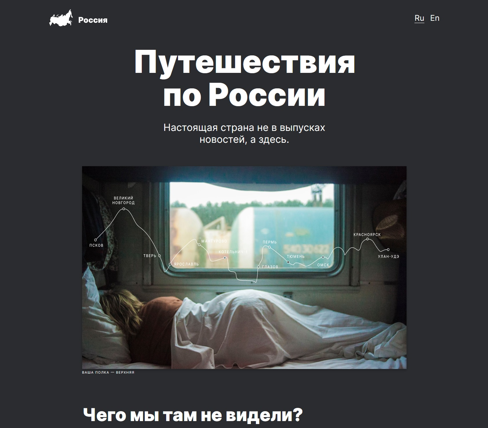

# Лендинг сайта "Путешествие по России"

## Превью лендинга

## Описание проекта

В проекте использована методология БЭМ Nested, сайт-лендинг адаптирован под экраны от 320 до 1280 пикселей.

## Технологии, использованные в проекте

* HTML
* CSS (FlexBox, Grid)
* БЭМ

## Ссылка на дэплой проекта

[GitHub Pages](https://mvttsun.github.io/russian-travel/)